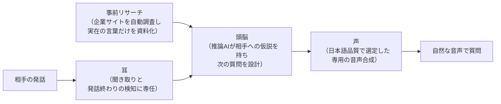

# AIインタビュー Type 5 改修のご報告（エグゼクティブサマリー）

**テーマ:** 従来構成（Type 1 / Type 2）からのアーキテクチャ刷新と、いただいたご意見への対応

---

## 1. 背景 — いただいた5つのご意見

これまでのデモ（Type 1 / Type 2）に対して、次のご意見をいただきました。

1. **日本語のイントネーションが不自然**に聞こえる場面がある
2. **音声の圧が強く**、落ち着いて話しにくい
3. **人間の発話終わりの検知に磨きをかけたい**（話し終わる前にAIがかぶせて話し始めないでほしい）
4. インタビューの内容が、もっと**内省を深掘りする**ものであってほしい
5. 良いインタビューは、**事前に相手のリサーチ**ができているものである

Type 5 では、この5点を「個別の調整」ではなく「仕組みの作り直し」で解決しました。本書はその要点のご報告です。

## 2. なぜ従来構成では難しかったのか

Type 1 / Type 2 は、「相手の発話 → 1つの音声対話AI → 音声で返答」という**一体型**の構成です。聞き取る耳・考える頭・話す声が1つのAIに固定されているため、応答は速い一方で、次の構造的な限界がありました。

- **声を選べない** — 日本語のイントネーションや声の質感・圧は、その音声対話AIに内蔵された声で決まってしまい、外から改善できません。
- **考える力を強化できない** — 質問を考える知能も同じAIに固定されており、「より深く考えるAI」に差し替えることができません。
- **立ち止まれない** — 相手の沈黙を検知すると即座に返答が始まる設計のため、言い淀みや考え込みの間（ま）を「まだ話し終えていない」と判断して待つ、という人間のインタビュアーが当たり前に行う振る舞いを作り込めません。

つまり、いただいた5つのご意見はいずれも、一体型のままでは根本対応が難しいものでした。

## 3. Type 5 の新アーキテクチャ — 「耳・頭脳・声」の分離

Type 5 では、1つのAIが担っていた役割を**専任の部品に分離**し、それぞれを最適なものに差し替えられる構成にしました。

- **耳:** 聞き取りと「相手が話し終えたか」の判定に専念します。返答の生成は行いません。
- **頭脳:** 会話全体と事前リサーチを踏まえ、「この人は何を信じている人か」という仮説を持ちながら次の質問を設計する、推論専任のAIです。
- **声:** 日本語の自然さを基準に選定した専用の音声合成です。声質・話す速さを目的に合わせて調整できます。

役割を分けたことで応答が遅くなるのでは、という懸念に対しては、頭脳が相手の発話中から先回りして質問を準備する仕組みを入れており、体感の応答速度は一体型と遜色ない水準を維持しています。

## 4. ご意見と改修ポイントの対応

| ご意見 | Type 1 / 2 での原因 | Type 5 での改修 |
| --- | --- | --- |
| 日本語のイントネーションが不自然 | 音声対話AI内蔵の声しか使えない | 音声生成を切り離し、日本語品質で選定した専用音声合成（ElevenLabs / Fish Audio）に置き換え |
| 音声の圧が強い | 声質・話し方を外から変えられない | 同じく専用音声合成への置き換えにより、声をデザイン可能に。落ち着いた声質の選定と話速の調整で対応 |
| 発話終わりの検知に磨きをかけたい | 沈黙を検知した瞬間にAIが返答を始める固定の仕組み | 言い淀みを待つ適応的な間と、発話の取り下げによるターンテイキング改善（下記） |
| 内省を深掘りしてほしい | 即答型のAIが表面的な相づち・派生質問を返しがち | 質問設計を推論専任のAIに移管。仮説を毎ターン更新し、記事インタビューの流れで進行（下記） |
| 事前リサーチができていてほしい | 一体型AIに事前資料を深く活用させる仕組みがない | 企業サイトの自動リサーチを導入し、インタビュー開始前に資料を準備（下記） |

### 4-1. 発話終わりの検知 — 「沈黙＝話し終わり」をやめる

従来は「沈黙が一定時間続いたら話し終わり」という固定ルールしかなく、考え込んでいる間にAIがかぶせて話し始める原因になっていました。Type 5 では、耳の役割を分離したことで発話終わりの判定そのものを設計できるようになり、次を導入しています。

- **言い淀みを待つ適応的な間:** 「うーん」「〜とか…」のような考え込み・言いさしを検知すると、AIは長めに待ちます。きれいに言い終えた時だけ通常の間合いで返します。長い回答の後も余韻を待ちます。
- **発話の取り下げ:** それでもAIが話し始めた直後に相手が話を続けた場合、AIは自分の発話を取り下げ、続きを聞いてから質問を作り直します。
- **相手優先の原則:** 相手が話し始めたら、AIの声は即座に停止します。

### 4-2. 内省の深掘り — 「即答」から「設計された問い」へ

- 頭脳のAIは毎ターン、**「この人は何を信じ、それはどこから来て、どこへ向かうのか」という仮説**を更新しながら質問を作ります。
- インタビュー全体は **理念・方針 → 原体験 → 現在の事業での表れ → 未来像** という記事インタビューの流れに沿って進行し、同じ話題を横に掘り続けることを防ぎます。
- 返答は、オウム返しではなく**「見立て（相手の話の言い換え・解釈）＋ 質問1つ」**の型に統一。相手が自分の言葉を別の角度から差し出されることで、内省が深まる構造にしています。

### 4-3. 事前リサーチ — インタビューの前に「読み込んでくる」

- インタビュー開始前に、対象企業のサイトを**複数ページ自動で調査**し、ミッション・事業内容・経営者の言葉を「頭の中の地図」として頭脳に渡します。
- 引用してよい言葉は**サイトに実際に書かれている言葉だけ**に照合する多層の検証機構を備えており、AIが事実と異なる社名・製品名・理念を口にすることを仕組みとして防ぎます。
- 画面上もリサーチの完了を待ってからインタビューを開始するフローに変更し、「準備のできたインタビュアー」として対話が始まります。

## 5. まとめ

一体型（Type 1 / 2）は応答の速さに優れる一方、**声・知能・準備を個別に磨けない**ことが、いただいたご意見の根本原因でした。Type 5 は耳・頭脳・声・事前リサーチを分離することで、それぞれを最適な部品に差し替え、継続的に改善できる構成へ刷新しています。日本語として自然な声で、相手を急かさず、事前準備に基づいて内省を引き出す——人間のインタビュアーの所作に近づけたことが、今回の改修の核心です。
